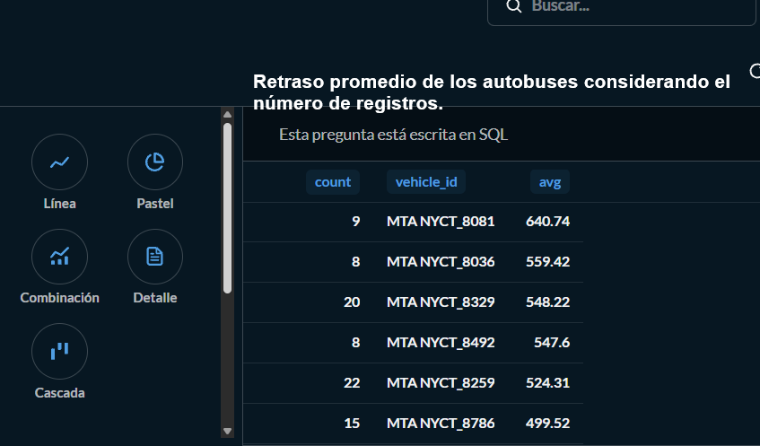
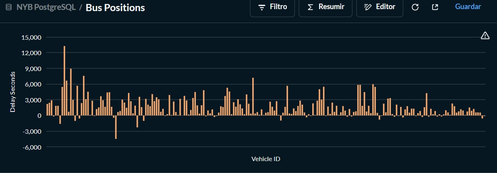

# 🚔 Análisis de la ruta de los autobuses de la ciudad de Nueva York | Data Engineering 

## 📌 Objetivo del proyecto

Realizar un análisis de los autobuses que siguen rutas especificas en la ciudad de Nueva York identificandolos a partir de un ID y hacer una clasificación en función de si es que estan llegando a tiempo, van atrazados o llegan antes del tiempo programado, así como el nombre de la estación a la que llegan. 

---

## 🛠️ Tecnologías utilizadas

  

- Python
- Docker
- Airflow
- Metabase
- PostgreSQL
- Pandas
- Excel 

---

## 🧱 Arquitectura del proyecto

  

---

## 🎥 Videos del proyecto

<table>
<tr>

<td align="center">

## 🎥 Explicación en Español

### 🇺🇸 English Version

</td>

</tr>
</table>

---

## 📊 Dashboard y visualizaciones

### Dashboard en Looker Studio

En el siguiente grafico se entiende que si el valor es negativo, entonces es porque dicho autobus esta llegando antes del tiempo asignado.

  
</a>

  
</a>

---

## 📂 Repositorio del proyecto

🔗 [Ver repositorio completo](https://github.com/EduardoGarcia12/NYC-BUS-Real-Time-Data-Pipeline)

---

## ⚙️ Flujo de trabajo del pipeline

1. Extraer los datos con ayuda de una API KEY y URL, trasformalos y cargarlos a PostgreSQL para poder visualizar información relevante con MetaBase. 
2. Orquestar el proceso ETL con ayuda de Airflow.
3. Dockerizar todo la arquitectura con a un archivo docker compose. 
4. Escribir consultas que nos ayuden a obtener nuestra información relevante. 
5. Visualización y análisis de los datos con Metabase.
---

## 📈 Resultados obtenidos

- Se logro obtener información muy importante por ejemplo en promedio cuanto tiempo llega un autobus a una parada en especifico. 
- La clasificación de los retrazos, llegada a tiempo o si es que iban adelantados en función de su tiempo de llegada.  
- Visualizar con ayuda de MetaBase la ruta que seguian en tiempo semi-real. 

---

## 🧠 Qué aprendí

- Escribir ventanas para observar tiempos determinados. 
- Orquestar codigo con Airflow.
- Escribir consultas sencillas en MetaBase. 
- Dockerizar toda mi arquitectura.  

---

## 🚀 Futuras mejoras

- Implementar kafka para hacer análisis de datos en tiempo real. 
- Escalar con BigQuery y posteriormente conectar mi base de datos a LookerStudio para automatizar todo el proceso.
- Obtener información mas especifica escribiendo consultas en BigQuery para la toma de decisiones. 

---
